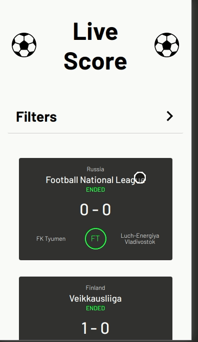

# Mobilt Challenge

The complete challenge description is available on the `test.pdf` file.

<p align="center" style="width:'150px'">
  
</p>

## Install

Clone the repo and run the command below to install and run the front-end

```
yarn && yarn start
```

Each component has it's own test file, to run all tests use the command below

```
yarn test
```

### What I used on this project

- React
- Jest
- Enzyme
- SCSS
